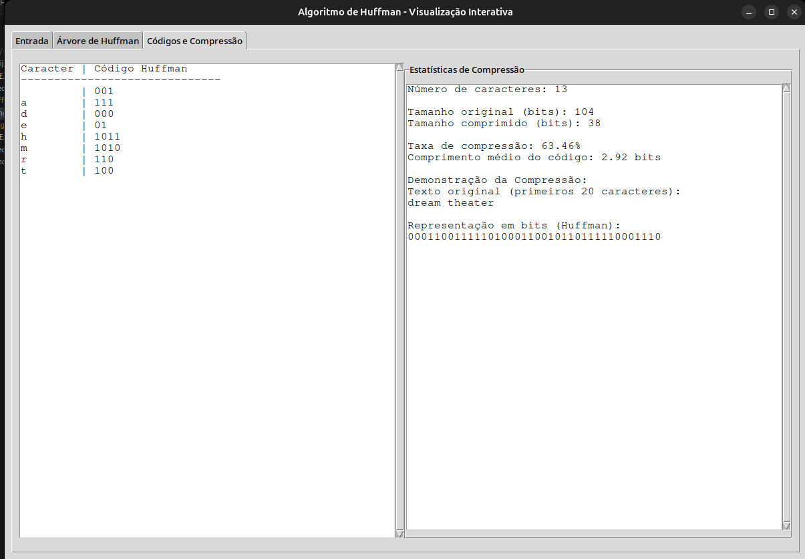

# Visualizador Interativo do Algoritmo de Huffman

Este programa é uma ferramenta educacional interativa que demonstra o funcionamento do algoritmo de codificação de Huffman, utilizado em compressão de dados.


## Alunos
|Matrícula | Aluno |
| -- | -- |
| 22/2021933  |  William Bernardo da Silva |
| 22/2015195  |  Mateus de Castro Santos |


## Requisitos

- Python 3.6 ou superior
- Bibliotecas necessárias (instale-as usando o arquivo requirements.txt)

## Instalação

1. Certifique-se de ter o Python instalado em seu sistema
2. Instale as dependências necessárias:

```bash
pip install -r requirements.txt
```

## Como Executar

Execute o programa com o seguinte comando:

```bash
python algoritmo.py
```

## Como Usar

1. Na primeira aba "Entrada", digite um texto na caixa de texto
2. Clique no botão "Processar" para iniciar o algoritmo
3. O programa irá exibir a tabela de frequências dos caracteres
4. Navegue para a aba "Árvore de Huffman" para visualizar o processo de construção da árvore passo a passo
   - Use os botões "Anterior" e "Próximo" para navegar entre os passos
5. Na aba "Códigos e Compressão", você verá os códigos de Huffman gerados para cada caractere e estatísticas sobre a compressão

## Funcionalidades

- Visualização interativa da construção da árvore de Huffman
- Exibição dos códigos gerados para cada caractere
- Cálculo de estatísticas de compressão
- Interface gráfica intuitiva com abas separadas para cada etapa do processo

## Sobre o Algoritmo de Huffman

O algoritmo de Huffman é um método de compressão sem perdas que usa códigos de tamanho variável para diferentes caracteres. Caracteres mais frequentes recebem códigos mais curtos, enquanto caracteres menos frequentes recebem códigos mais longos, resultando em uma representação mais eficiente do texto original.

## Observações

A visualização da árvore pode não ser perfeita para textos muito longos ou com muitos caracteres únicos devido a limitações de espaço na tela. 

## Screenshots

### Execução passo a passo


### Arvore de Huffman


### Resultado final



## Outros

[Video Apresentação](https://youtu.be/vDPJeTLdV3g?si=57MLgT33ndfai9tc)